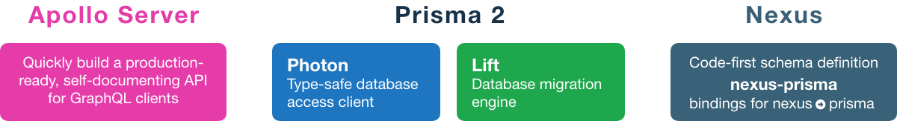
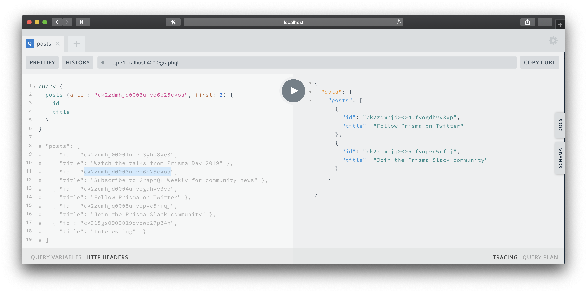

# Implementing Pagination using GraphQL
In this article/tutorial, you will learn how to about the fundamentals of **pagination** and how to its implemented using GraphQL. **Pagination** is used in many applications today, ranging from displaying pages search results to fetching more results at the bottom of an application feed. By the end of this post, you should **better understand pagination** AND have the **ability to build a GraphQL API serving paginated requests.** 

## Introduction to Pagination
**Pagination is a practice of requesting subsets**, or "pages" of data in your applications, allowing client applications to **avoid requesting every available record.** In most cases, pagination should **improve application performance** and **reduce the stress** on backend servers. Pagination can be built to serve **literal pages of data** (e.g. 10 pages, 50 records per page), as you have likely seen with **Google search results**, implement features like the **"Infinite Scrolling" effect** used in the **Twitter/Instagram**, and many other use cases.

<p align="center">
  
</p>

There are multiple ways to implement pagination with their own use cases. **Two of the most common** approaches are **Offset-based** and **Cursor-based** pagination. Both of these approaches typically require providing the **first record** to retrieve as well as the **number of records before/after** the first record. The primary difference between these two approaches is selecting the **first record by an id** - *a cursor* - versus by **skipping a number** of records - *an offset*.

### Offset-based Pagination
---
Using **offset-based** pagination, requests should specify the **number of records to skip** in the database (a.k.a. the offset) and the **number of additional records to fetch**. The number of records after the offset is often called the **count or limit**. Offset-based pagination is often easy to implement, while providing end users the ability to jump between specific pages. 


<p align="center">
  
</p>


**Two issues to address** when considering offset-based pagination are: **(1) loss of speed is at scale** -- database will still read data from the disk - up to the offset + count and **(2) unstable to use numerical offset** - especially with rapidly changing data. To better understand issue **(2)**, imagine the scenario described by the sequence of steps and image below.

<p align="center">
  
</p>

The scenarios above depicts **2 requests** at **different points in time**, from the same client. In this example of pagination, **4 items** are returned **per page**. The 1st request **returns results 1-4** and the 2nd request will **return results 5-8**. Imagine **a new record** is added by a different user **between the 1st and 2nd** request. Now the **original 4th record** will be pushed back to the **5th record in the database**, because of the new record, and therefore also **returned in the 2nd request**.

### Cursor-based Pagination
---
Using the **cursor-based** approach, the request will specify **a unique identifier of the first record** (a.k.a. the cursor). The request should also include a count of records to include. **Cursor-based** solutions tend to be **more flexible** and are the go-to option with **quickly changing data**. The drawbacks include **no concept** of the **total number of pages/results** in the set and the client can no longer **jump to a specific page**. 

<p align="center">
  
</p>

In the [step-by-step tutorial below](#tutorial), you will see how **simple and quick** it is to set up an **API serving paginated data from a live database**. You will use [Prisma](https://prisma.io) and [Nexus](https://nexus.js.org), which provide **out-of-the box support** for pagination. The **"cursor"** is equivalent to the **before** or **after** arguments and the number of additional records is passed as the argument **first** or **last** - depending on the query uses before OR after.

If you'd like to learn more about cursor vs offset-based pagination, you should [read this blog post](https://slack.engineering/evolving-api-pagination-at-slack-1c1f644f8e12) written by the Slack development team.

## Tutorial



It is time to get hands on and **create a functional pagination example** using the following technologies: GraphQL, Prisma, Photon/Lift, Nexus, Nexus-Prisma,  and SQLite. Using these technologies, you can create a server with pagination running in less than 30 minutes. Here is a high-level overview of the steps that will be envolved in the process.

1. [Install the Prisma Framework](#1-install-prisma-framework)
2. [Initialize Prisma Project and NPM Project](#2-initialize-prisma-project-and-npm-project)
3. [Add Project Scripts and Install Dependencies](#3-add-project-scripts-and-install-dependencies)
4. [Create Apollo Server and Photon Client](#4-create-apollo-server-and-photon-client)
5. [Creating & Exposing Schema using GraphQL Nexus](#5-creating--exposing-schema-using-graphql-nexus)
6. [Database migration using Lift](#6-database-migration-using-lift)


### 1. Install Prisma Framework

This will install the Prisma Framework globally on your local machine, providing a CLI for initializing Prisma applications.

```
npm install prisma2 -g
```

### 2. Initialize Prisma Project and NPM Project
In your project directory, run the command below -- *following the prompt options listed* -- which will initialize a project using the Prisma Framework. After the following the prompts, you should now have a directory called *pagination-example* with a *prisma* folder inside.
```
npx prisma2 init pagination-example
  - blank project
  - SQLite
  - include photon and lift -> confirm
  - JavaScript - feel free to use TypeScript 
  - Just the prisma schema
```

You also need to create package.json for your project via running `npm init -y` inside of the *pagination-example* directory. This will allow you to add scripts and dependencies (e.g. apollo, nexus, etc) to the project.

```
cd pagination-example
npm init -y
```

### 3. Add Project Scripts and Install Dependencies

In package.json, you need to add to projects scripts to (1) run your Apollo Server and (2) generate the database access client. The postinstall hook will auto-generate the database access client after any installations.

```js
"dev": "node ./index.js",
"postinstall": "prisma2 generate"
```

Next, you need to install the required dependencies for the project. **nexus-prisma** provides out-of-the-box support for features like **pagination, ordering and sorting** - as well as the ability to make use of `t.model/t.crud`, which can help making it **quick and easy to expose types**.

```
npm install prisma2 --save-dev        # photon & lift
npm install express                   # standard node.js server
npm install apollo-server-express     # standard graphql express server
npm install nexus                     # code-first graphql schema creation
npm install nexus-prisma              # bindings for nexus & prisma
npm install graphql                   # required peer dependency
```
You should notice this probably unfamiliar line print in the console: *"Downloading darwin binary for query-engine and migration-engine"*. This is the postinstallation hook running and generating the Photon client.

### 4. Create Apollo Server and Photon Client
Time to build the actual server - start by creating standard Apollo Server with no special functionality added yet. Typically you would provide schema's typeDefs and resolvers - as template literals - to the ApolloServer constructor. However, in this example you create the schema using the code-first approach with GraphQL Nexus - which you will implement in step #5.

```js
// index.js
const express = require('express');
const { ApolloServer } = require('apollo-server-express');
const { Photon } = require('@generated/photon')

// photon client
const photon = new Photon()

// you will add GraphQL Nexus schema here in next step

const server = new ApolloServer({ });

const app = express();
server.applyMiddleware({ app });

app.listen({ port: 4000 }, () =>
  console.log(`🚀 Server ready at http://localhost:4000${server.graphqlPath}`)
);
```
        
### 5. Creating & Exposing Schema using GraphQL Nexus

Time to build the schema - code-first. Start with the required imports - nexus: to create your GraphQL types & schema; nexus-prisma: provides the bindings between nexus & prisma. 

```js
// 1. imports - index.js
const { objectType, queryType, makeSchema } = require("nexus")
const { nexusPrismaPlugin } = require('nexus-prisma')
const { join } = require('path')
```
      
Next, add the types you wish to expose in your API. The first two types created below is an *objectType* for both User and Post. This publicly exposes the id/email fields for Users and id/title/author for Posts.

```js 
// 2. user/post type - index.js
const User = objectType({
  name: 'User',
  definition(t) { t.model.id(), t.model.email() }
})
const Post = objectType({
  name: 'Post',
  definition(t) { t.model.id(), t.model.title(), t.model.author() }
})
```

Next, create a root Query using *queryType*, to start exposing queries, beginning with the posts query. Thanks to Photon and Nexus-Prisma, you have out-of-the-box for pagination and can implement it in as few lines as shown below. You have now exposed a "posts" query that can handle pagination.

```js 
// 3. query type - index.js
const Query = queryType({
  definition(t) {
    t.crud.posts({ pagination: true })
  }
});
```

Next, you create a schema using *makeSchema*, which includes your types, the nexus-prisma plugin and an outputs object. This combines all of the above types into a GraphQL Schema.

```js
// 4. create schema - index.js
const schema = makeSchema({
  types: [Query, User, Post],
  plugins: [nexusPrismaPlugin()],
  outputs: {
    typegen: join(
      __dirname,
      '../node_modules/@types/nexus-typegen/index.d.ts',
    ),
  },
});
```

Finally, you need to update the ApolloServer constructor to include the schema and photon instance. Your Photon instance is now available via the context argument.

```js
// 5. pass schema/photon - index.js
const server = new ApolloServer({ schema, context: { photon } })
```

### 6. Database Migration using Lift
The last step is to apply our database migration using Lift to actually setup the SQLite database. **First,** you need to run `prisma2 lift save` to prepare our migration. Terminal will prompt for a name for the migration, which is up to you! Lift keeps a history of all migrations (similar to a git history) which will allow you to revert migrations in the future. 

After you name the migration, you need to actually apply the changes to our database. To do this, you run `prisma2 lift up` and our database will be up-to-date. Now you can test our queries by running your ApolloServer using GraphQL playground! 

You will also need to seed your database with some post records one of two ways:
* **manually** using Prisma Studio, which can be thought of as an *IDE to your database*, providing a web-based interface to handle the data in the database. You can run access Prisma Studio by running `prisma2 dev` in the *root project directory* and visting the url in the terminal output.
* **programmatically** by running a function in apollo-server that *creates the records* from the photon client.
&nbsp;

```js
// programmatically
async function seedDb() {
  try {
    // create a user
    const user = await photon.users.create({
      data: {
        email: 'alicde4sc@f43prisma.io',
        name: 'alice',
      }
    })
    // create a post
    const post_1 = await photon.posts.create({
      data: {
        title: 'Example Post 1',
        author: { connect: { id: user.id } }, published: true
      },
    })
    // ...should create a few more posts
  } catch (err) {
    console.log(err)
  }
}
```

### Complete - Working Pagination
Time to test what you've built! You can now use the GraphQL playground tool at the address of your running Apollo Server to test your query. In the example below, the commented out posts represent the entire dataset -- while the paginated results are requesting by providing an **after** and **first** argument to the query.



## Wrap Up
Hopefully this provided an overview of the simplicity and power of the Prisma Framework. With the auto-generated Photon client and power of GraphQL Nexus with Prisma, developers can add pagination to a project very quickly. If you have any questions, feel free to leave them in the comments and we will hope to help clarify and issues you have!
